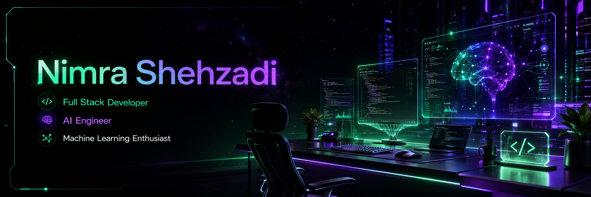

<p align="center">
  
</p>

<p align="center">
  
</p>
<h1 align="center">
  
  Welcome to My GitHub Universe
</h1>

<h2 align="center">
  <b>Nimra Shehzadi</b>
</h2>

<h3 align="center">
💻 Full Stack Developer • 🤖 AI Engineer • 🚀 AI & Machine Learning Developer
</h3>

<p align="center">
Building intelligent web applications and AI-powered solutions with modern technologies, clean architecture, and exceptional user experiences.
</p>


## 🚀 About Me

<p align="center">
<i>Transforming ideas into intelligent software through clean code, creativity, and AI innovation.</i>
</p>

<table>
<tr>

<td width="65%" valign="top">

```yaml
👩 Name: Nimra Shehzadi
💼 Role: Full Stack Developer & AI Engineer
📍 Based In: Pakistan
🎓 Degree: BS Computer Science
🚀 Specialization: AI • Full Stack • Machine Learning
💻 Current Focus: Frontend AI Engineering Internship
🎯 Mission: Creating impactful AI-powered digital experiences
```

- 🚀 Building scalable and modern web applications.
- 🤖 Developing AI-powered solutions with practical impact.
- 📚 Continuously learning emerging technologies.
- 💡 Passionate about clean code, UI/UX, and problem solving.
- 🌍 Open to collaboration on innovative software projects.
- 📫 Reach me: **nimra.shehzadi.5094@gmail.com**

</td>

<td width="35%" align="center">


</td>

</tr>
</table>

<h2 align="center">🌐 Connect With Me</h2>

<p align="center">
<a href="https://www.linkedin.com/in/nimra-shehzadi-22262338a/" target="_blank">

</a>

<a href="mailto:nimra.shehzadi.5094@gmail.com">

</a>

<a href="https://github.com/Nimra-Shehzadi">

</a>
</p>


<h3 align="left">Languages and Tools:</h3>
<p align="left"> <a href="https://www.cprogramming.com/" target="_blank" rel="noreferrer">  </a> <a href="https://www.w3schools.com/cpp/" target="_blank" rel="noreferrer">  </a> <a href="https://www.w3schools.com/css/" target="_blank" rel="noreferrer">  </a> <a href="https://www.figma.com/" target="_blank" rel="noreferrer">  </a> <a href="https://www.w3.org/html/" target="_blank" rel="noreferrer">  </a> <a href="https://www.java.com" target="_blank" rel="noreferrer">  </a> <a href="https://www.mongodb.com/" target="_blank" rel="noreferrer">  </a> <a href="https://www.microsoft.com/en-us/sql-server" target="_blank" rel="noreferrer">  </a> <a href="https://www.mysql.com/" target="_blank" rel="noreferrer">  </a> <a href="https://nodejs.org" target="_blank" rel="noreferrer">  </a> <a href="https://opencv.org/" target="_blank" rel="noreferrer">  </a> <a href="https://www.oracle.com/" target="_blank" rel="noreferrer">  </a> <a href="https://pandas.pydata.org/" target="_blank" rel="noreferrer">  </a> <a href="https://www.php.net" target="_blank" rel="noreferrer">  </a> <a href="https://www.python.org" target="_blank" rel="noreferrer">  </a> <a href="https://pytorch.org/" target="_blank" rel="noreferrer">  </a> <a href="https://scikit-learn.org/" target="_blank" rel="noreferrer">  </a> <a href="https://seaborn.pydata.org/" target="_blank" rel="noreferrer">  </a> <a href="https://www.tensorflow.org" target="_blank" rel="noreferrer">  </a> </p>

<p>&nbsp;</p>

<p></p>


